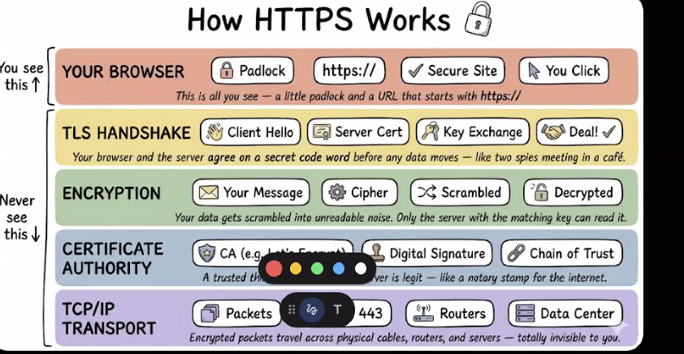

# AI Catalyst — Claude Code Skills

A collection of Claude Code skills for content creation, visual explanation, and social media publishing.

## Skills

### sketch-explainer
Turns any topic into a whiteboard-style explainer diagram and AI-generated image. Chooses the best diagram format automatically (iceberg, flowchart, swim lanes, etc.), produces a structured spec and image prompt, then calls the image-generator skill to render it.

### image-generator
Standalone image generation skill. Accepts a topic slug and prompt, calls the Gemini API, and saves the image to disk. Can be called independently by any skill or agent.

### linkedin-post
Researches any topic on the internet first, then writes a professional LinkedIn post with a strong hook, insightful body, hyphen bullets, proper spacing, and up to 3 hashtags. Never writes before researching.

### social-media-agent
Full LinkedIn content pipeline in one command. Given a topic, it researches, writes a post, generates a whiteboard diagram image, and publishes or schedules to LinkedIn. Supports `--no-image`, `--draft`, `--schedule`, `--timezone`, and `--tone` flags.

### linkedin-post-creator
Publishes and schedules LinkedIn posts via the Zernio API. Supports text-only posts, image posts, and scheduled publishing. Pass a **local image file path** and the script automatically commits it to `assets/linkedin/` in the GitHub repo and uses the raw URL — no manual hosting required. Account ID and API keys are stored in the shared gitignored config.

## Diagram Formats (sketch-explainer)

| Format | Best for |
|---|---|
| **Swim Lanes** | Layered systems, protocol stacks (DNS, HTTPS, JWT) |
| **Flowchart** | Decisions, branching logic, troubleshooting |
| **Linear Steps** | How-to guides, tutorials, step-by-step processes |
| **Grid / Matrix** | Comparisons, pros/cons, 2×2 frameworks |
| **Wheel / Radial** | Cycles, feedback loops, hub + attributes |
| **Timeline** | History, project phases, chronological progression |
| **Iceberg** | Visible vs. hidden, surface symptoms vs. root causes |

## Setup

### 1. Configure API keys

Create `.claude/skills/config.env` — this file is gitignored and never committed:

```
GEMINI_API_KEY=your-gemini-key-here
ZERNIO_API_KEY=your-zernio-key-here
LINKEDIN_ACCOUNT_ID=your-linkedin-account-id-here
```

- **Gemini key**: [aistudio.google.com](https://aistudio.google.com) — requires billing enabled for image generation
- **Zernio key**: [zernio.com](https://zernio.com) → Settings → API Keys
- **LinkedIn account ID**: run `list_accounts.ps1` after connecting LinkedIn in Zernio

For the **unattended scheduled runner** (`scripts/run_scheduled.sh`), secrets are pulled from GCP Secret Manager instead of `config.env`, including one not needed for interactive use:

- `anthropic-api-key` — drives the Claude CLI in headless mode (interactive use relies on your logged-in session, so this secret only matters for cron)
- `AILinkedInPost-Github-token` — pushes generated images to GitHub. Use a **fine-grained PAT scoped to `contents:read/write` on this repo only**, not a broad classic token
- `github-username`, `zernio-api-key`, `gemini-api-key`, `linkedin-account-id`

### 2. Connect LinkedIn to Zernio

Go to [zernio.com](https://zernio.com) → Settings → Connected Accounts → Add LinkedIn. Then run:

```powershell
& ".claude\skills\linkedin-post-creator\scripts\list_accounts.ps1"
```

Copy the LinkedIn account ID into `config.env`.

### 3. Use the skills

```
# Full pipeline — one command does everything
/social-media-agent AI taking over jobs
/social-media-agent Web3 is dead --no-image
/social-media-agent future of remote work --schedule "2026-05-20T09:00:00" --timezone "Asia/Kolkata"
/social-media-agent quantum computing --draft

# Individual skills
/sketch-explainer wealth creation
/sketch-explainer will AI take over humanity

/linkedin-post AI agents replacing jobs
/linkedin-post the future of remote work

/linkedin-post-creator    ← publishes to LinkedIn via Zernio
```

## Scheduled Runner (`scripts/run_scheduled.sh`)

Unattended weekly pipeline. A **shell script orchestrates**; the LLM is called only for the two reasoning steps (write copy, design image prompt) — each on **Haiku**, turn-capped, and restricted to read/research tools. Image rendering and publishing are direct `pwsh` calls with fixed arguments, so the LLM never has authority to `git push` or publish. This keeps cost bounded up front (a runaway Opus loop is structurally impossible) and shrinks blast radius.

```bash
./scripts/run_scheduled.sh "generate a post on latest AI buzz"

DRY_RUN=1 ./scripts/run_scheduled.sh "AI agents"      # run everything except publish; print the draft
NO_IMAGE=1 ./scripts/run_scheduled.sh "remote work"   # text-only post
COST_CEILING=0.50 ./scripts/run_scheduled.sh "..."    # circuit-breaker ceiling in $ (default 1.00)
```

- **Pause without editing crontab:** `touch scripts/.pipeline-disabled` (delete to resume).
- **Cost/observability:** every stage appends `turns` + `$cost` to `linkedin-cost.log` (repo root). Use it to tighten `--max-turns` and set a steady-state `COST_CEILING`.
- **Requires** PowerShell 7 (`pwsh`) and `python3` on the runner (the Linux VM).

## Example Topics

| Topic | Skill | Format |
|---|---|---|
| `wealth creation` | sketch-explainer | Iceberg |
| `will AI take over humanity` | sketch-explainer | Flowchart |
| `how JWT authentication works` | sketch-explainer | Swim Lanes |
| `AI agents replacing jobs` | linkedin-post | Research → post |
| `post this to LinkedIn now` | linkedin-post-creator | Publish via Zernio |

## File Structure

```
scripts/
  run_scheduled.sh                      ← unattended orchestrator (secrets → write → image → publish)
  lib_claude_stage.sh                   ← scoped/bounded Claude stage runner + cost logging
linkedin-cost.log                       ← per-run turns + $ cost (gitignored)
assets/
  linkedin/                             ← generated images committed here for public GitHub URLs
.claude/
  agents/
    social-media-agent.md               ← orchestrator agent (research + image + publish)
  skills/
    config.env                          ← shared API keys (gitignored, never commit)
    sketch-explainer/
      SKILL.md
      references/                       ← format specs (flowchart, iceberg, etc.)
    image-generator/
      SKILL.md
      scripts/
        generate_image.ps1              ← Gemini API caller
    linkedin-post/
      SKILL.md                          ← research + write LinkedIn posts
    linkedin-post-creator/
      SKILL.md
      scripts/
        list_accounts.ps1               ← find your LinkedIn account ID
        post_linkedin.ps1               ← publish or schedule via Zernio (-ImagePath auto-pushes to GitHub)
```

## Reference Image

The target whiteboard style is based on this "How HTTPS Works" explainer:


